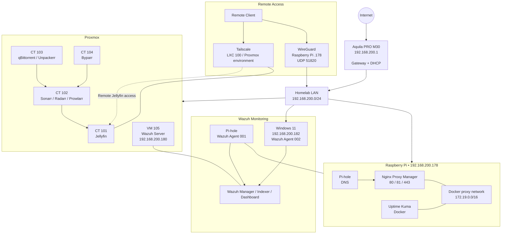

# Homelab Infrastructure Stack

## Overview

This project documents the integrated infrastructure stack deployed in my Raspberry Pi homelab.

The environment combines centralized DNS filtering, reverse proxying, infrastructure monitoring, Docker networking, and centralized security monitoring into a single service architecture.

The stack consists of:

- Aquila PRO M30 router
- DHCP
- Pi-hole DNS
- Raspberry Pi Linux server
- Docker and Docker Compose
- Nginx Proxy Manager
- Uptime Kuma
- Docker bridge networking
- Shared external Docker network
- Wazuh security monitoring
- Linux and Windows endpoint monitoring
- Automated SSH containment

The infrastructure was configured and validated through hands-on testing using Linux networking tools, DNS queries, Docker inspection, and service connectivity tests.

This project serves as a capstone demonstrating how infrastructure, monitoring, and security services can be integrated into a functional homelab environment.

---

## Architecture

The master architecture below shows the current live homelab, including the LAN, Proxmox workloads, Raspberry Pi services, Wazuh monitoring, and the two remote-access paths.



### Architecture Notes

- **Tailscale** runs in the Proxmox environment and provides the remote-access path used to reach the Proxmox-hosted Jellyfin service.
- **WireGuard** terminates on the Raspberry Pi and provides remote access into the `192.168.200.0/24` homelab network through the Pi.
- **Pi-hole** provides network DNS and also hosts the Raspberry Pi Docker services.
- **Nginx Proxy Manager** provides the reverse-proxy and HTTPS layer for web services.
- **Uptime Kuma** monitors homelab services and participates in the shared Docker `proxy` network.
- **Wazuh** runs as VM 105 and receives telemetry from the Pi-hole and Windows agents.
- **Proxmox** hosts the media automation stack and Wazuh VM.
- The Samba, SQL Server, and Portainer projects are documented separately and are not shown as live services because those VMs are currently powered off.

---

## Network Foundation

The physical and logical LAN is built around the Aquila PRO M30 router.

### Router

**Device:** Aquila PRO M30

**IP Address:** `192.168.200.1`

**Role:**

- Default gateway
- DHCP server
- Internet connectivity
- Local network routing

The router provides DHCP addressing for devices on:

```text
192.168.200.0/24
```

---

## Raspberry Pi

**IP Address:** `192.168.200.178`

**Operating System:** Debian Linux

The Raspberry Pi acts as the primary homelab server.

It provides:

- Pi-hole DNS
- Docker hosting
- Nginx Proxy Manager
- Uptime Kuma
- SSH administration

The static IP allows services hosted on the Raspberry Pi to remain reachable at a predictable address.

---

## DNS Layer

Pi-hole provides DNS services for the network.

**DNS Server:**

```text
192.168.200.178
```

Network clients can use the Raspberry Pi as their DNS server while the router remains the default gateway.

Pi-hole provides:

- DNS resolution
- DNS-based advertisement blocking
- Local DNS records
- DNS services for network clients

The DNS path can be represented as:

```text
Client Device
      |
      | DNS query
      v
192.168.200.178
      |
      v
   Pi-hole
      |
      v
Upstream DNS
```

---

## Docker Layer

Docker provides the application platform for the containerized services.

The primary shared network used by the reverse proxy stack is:

```text
proxy
172.19.0.0/16
```

This is an external Docker bridge network shared between Docker Compose projects.

The network allows services that need to communicate with the reverse proxy to participate in the same Docker network.

---

## Nginx Proxy Manager

Nginx Proxy Manager provides the reverse proxy layer.

Its responsibilities include:

- Reverse proxying
- HTTPS termination
- Domain-based routing
- SSL certificate management
- Forwarding requests to internal services

Nginx Proxy Manager is connected to:

```text
proxy
172.19.0.0/16
```

Its Docker address on the network is:

```text
172.19.0.3
```

The reverse proxy provides a controlled entry point for web-based services.

---

## Uptime Kuma

Uptime Kuma provides infrastructure and service monitoring.

Uptime Kuma is connected to two Docker networks:

```text
proxy
172.19.0.0/16
```

and:

```text
uptime-kuma_default
172.18.0.0/16
```

Its addresses are:

```text
proxy:
172.19.0.2
```

```text
uptime-kuma_default:
172.18.0.2
```

The two-network configuration allows Uptime Kuma to participate in the shared proxy network while retaining its Compose-managed default network.

---

## Integrated Docker Architecture

The Docker portion of the infrastructure can be represented as:

```text
Docker Host
    |
    +-----------------------------+
    |                             |
    v                             v
 proxy                       uptime-kuma_default
172.19.0.0/16                 172.18.0.0/16
    |                             |
    |                             |
    +-----------+                 |
                |                 |
                v                 v
       Nginx Proxy Manager     Uptime Kuma
          172.19.0.3           172.18.0.2
                |
                |
                +------ Uptime Kuma
                        172.19.0.2
```

This demonstrates Docker multi-network connectivity.

Uptime Kuma participates in both networks, while Nginx Proxy Manager only participates in the shared `proxy` network.

---

## Service Relationships

The services have different responsibilities within the infrastructure.

```text
                    NETWORK
                       |
             +---------+---------+
             |                   |
             v                   v
          DHCP                 DNS
        Router              Pi-hole
             |                   |
             +---------+---------+
                       |
                       v
                 Raspberry Pi
                       |
                 Docker Host
                       |
             +---------+---------+
             |                   |
             v                   v
      Nginx Proxy Manager    Uptime Kuma
             |                   |
             |                   |
             +---------+---------+
                       |
                       v
                  proxy network
                 172.19.0.0/16
```

Each service has a specific role rather than performing the same function:

| Component | Primary Role |
|---|---|
| Aquila PRO M30 | Gateway and DHCP |
| Pi-hole | DNS and DNS filtering |
| Raspberry Pi | Homelab server and Docker host |
| Nginx Proxy Manager | Reverse proxy and HTTPS |
| Uptime Kuma | Service monitoring |
| Docker | Container platform |
| `proxy` | Shared container network |

---

## Example Traffic Flows

### DNS Request

A client requesting a domain name follows this path:

```text
Client
   |
   | DNS request
   v
Pi-hole
192.168.200.178
   |
   | DNS resolution/filtering
   v
Upstream DNS
```

The router provides network connectivity and DHCP, while Pi-hole handles DNS.

---

### Web Service Request

A web request can follow this general path:

```text
Client
   |
   v
Router
   |
   v
Raspberry Pi
   |
   v
Nginx Proxy Manager
   |
   v
Docker proxy network
172.19.0.0/16
   |
   v
Internal Web Service
```

Nginx Proxy Manager provides the reverse proxy layer between incoming web traffic and internal services.

---

### Monitoring

Uptime Kuma provides monitoring for services and endpoints within the homelab.

Its Docker network configuration allows it to participate in the shared `proxy` network:

```text
Nginx Proxy Manager
172.19.0.3
       |
       | proxy
       |
       v
Uptime Kuma
172.19.0.2
```

Uptime Kuma also remains attached to its Compose-managed network:

```text
uptime-kuma_default
172.18.0.0/16
```

---

## Infrastructure Validation

The infrastructure was validated using commands from the Linux and Docker troubleshooting toolkit.

### Linux Network Configuration

```bash
ip addr
```

Used to verify network interfaces and IP addressing.

```bash
ip route
```

Used to verify routing and the default gateway.

---

### Docker Validation

```bash
docker ps
```

Used to verify running containers.

```bash
docker inspect uptime-kuma
```

Used to inspect Uptime Kuma's configuration and network attachments.

```bash
docker network ls
```

Used to identify Docker networks.

```bash
docker network inspect proxy
```

Used to verify the shared `proxy` network, subnet, gateway, and connected containers.

---

### DNS Validation

```bash
dig google.com @192.168.200.178
```

Used to explicitly test DNS resolution through Pi-hole.

DNS filtering was also validated by testing a blocked advertising domain:

```text
doubleclick.net → 0.0.0.0
```

---

### Pi-hole Validation

```bash
pihole status
```

Used to check Pi-hole service status.

```bash
pihole -t
```

Used to observe DNS queries reaching Pi-hole.

---

### Application Validation

HTTP and HTTPS connectivity can be tested using:

```bash
curl
```

This provides a method for determining whether a web application or reverse proxy is responding.

---

## Troubleshooting Methodology

The infrastructure follows a layered troubleshooting approach.

When a service is unavailable, the investigation can proceed through:

```text
Symptom
   |
   v
Check Process / Container
   |
   v
Check Listening Port
   |
   v
Check IP Configuration
   |
   v
Check Routing
   |
   v
Check Docker Networking
   |
   v
Check Service Connectivity
   |
   v
Check Application Response
   |
   v
Check DNS
```

This prevents immediately changing configuration without first identifying the layer where the failure occurs.

---

## Security Monitoring

The infrastructure has been extended with a dedicated Wazuh security monitoring environment.

The Wazuh server runs on Ubuntu 24.04.5 LTS at:

```text
192.168.200.180
```

It provides:

- Wazuh Manager
- Wazuh Indexer
- Wazuh Dashboard
- Centralized endpoint monitoring
- Security event collection
- Detection and investigation
- Automated response

The current monitored endpoints are:

| Endpoint | Address | Role |
|---|---|---|
| Pi-hole | `192.168.200.178` | Linux endpoint / DNS / Docker host |
| Windows 11 | `192.168.200.182` | Windows endpoint |

### Security Architecture

```text
                    Homelab LAN
                 192.168.200.0/24
                         |
            +------------+------------+
            |                         |
            v                         v
       Pi-hole                     Windows 11
       .178                         .182
       Wazuh Agent                 Wazuh Agent
            |                         |
            +------------+------------+
                         |
                         v
                  Wazuh Server
                     .180
                         |
              +----------+----------+
              |          |          |
              v          v          v
           Manager    Indexer    Dashboard
```

The security lab includes:

- Linux SSH monitoring
- Windows authentication monitoring
- Windows Defender telemetry
- Windows Firewall telemetry
- File Integrity Monitoring
- Rootcheck
- Security Configuration Assessment
- System inventory
- Controlled security-event testing
- Automated SSH containment

The first automated-response workflow also demonstrated an important operational lesson. Wazuh's generic `firewall-drop` response affected the Pi-hole's Docker forwarding path, so the response was redesigned as a custom `ssh_contain` workflow that validates the source and restricts containment to SSH traffic on the Pi-hole INPUT chain.

Detailed security documentation is maintained under:

```text
security/wazuh/
```


---

## Media Automation

The Proxmox media automation environment is documented under `media-automation/README.md`.

---

## Remote Access

The WireGuard remote-access environment is documented under `remote-access/wireguard/README.md`.

It provides encrypted remote access to the homelab through the Raspberry Pi while keeping internal services behind the homelab's access boundaries.

---

## Internal PKI / TLS

The internal certificate infrastructure is documented under `security/pki/README.md`.

It provides a private Root CA and trusted HTTPS certificates for internal `home.arpa` services.

---

## Backup & Recovery

The automated backup environment is documented under `backup-recovery/README.md`.

It protects key application databases by copying them on a scheduled basis to a separate SMB-backed storage location.

---

## Security Posture and Remediation Status

**Review status:** Security audit and repository remediation in progress  
**Last reviewed:** September 2026

The infrastructure documentation has been reviewed for credential exposure, service access boundaries, container configuration, and security-monitoring coverage.

### Completed

- Historical plaintext credentials were removed from the affected repository histories.
- Current credential handling was changed to local/environment-based configuration where applicable.
- Wazuh server hardening and endpoint monitoring are documented under `security/wazuh/`.
- Windows Defender and Windows Firewall telemetry are documented.
- SSH detection and the custom `ssh_contain` response are documented.
- Access-boundary findings for Samba, SQL Server, Nginx Proxy Manager, and Portainer have been documented in their respective projects.
- Live Docker image references for Nginx Proxy Manager and Uptime Kuma were pinned to their currently validated application versions without performing an application upgrade.
- The pinned Compose definitions were validated successfully.

### Pending live validation

The following changes require access to the live homelab and should not be inferred from repository configuration alone:

- Samba guest-write remediation
- SQL Server TCP/1433 access restriction
- Nginx Proxy Manager TCP/81 management restriction
- Portainer management-access review
- Controlled container recreation using the pinned Nginx Proxy Manager and Uptime Kuma image references

These are intentionally handled as controlled changes so existing services and backup workflows can be validated after each modification.

### Security documentation model

The capstone describes the architecture and intended trust boundaries. Individual project repositories remain the authoritative location for service-specific configuration and remediation procedures.


## Related Projects

This capstone builds upon the individual projects documented separately in my homelab portfolio.

### Homelab Network Architecture

Documents the physical and logical network architecture, including:

- Router
- DHCP
- Raspberry Pi
- DNS
- Pi-hole

### Docker Network Segmentation

Documents:

- Docker bridge networking
- External Docker networks
- `proxy`
- `uptime-kuma_default`
- Multi-network containers
- Container-to-container communication

### Pi-hole DNS Network

Documents:

- Pi-hole deployment
- DNS configuration
- Network client discovery
- DNS troubleshooting
- DNS filtering validation

### Wazuh Security Monitoring

Documents:

- Wazuh server deployment and hardening
- Linux endpoint monitoring
- Windows endpoint monitoring
- SSH detection and automated containment
- Windows Defender telemetry
- Windows Firewall telemetry
- Security-event validation

See the complete security project under `security/wazuh/`.

### Linux Service Troubleshooting

Documents a repeatable troubleshooting methodology using:

- `ip addr`
- `ip route`
- `ss`
- `docker ps`
- `docker inspect`
- `docker network inspect`
- `curl`
- `dig`
- `pihole status`
- `pihole -t`

---

## Skills Demonstrated

This capstone demonstrates practical experience with:

- Linux system administration
- Network architecture
- TCP/IP fundamentals
- IP addressing
- DHCP
- DNS
- Pi-hole
- Docker
- Docker Compose
- Docker bridge networking
- External Docker networks
- Multi-network containers
- Nginx Proxy Manager
- Reverse proxy architecture
- HTTPS
- SSL certificate management
- Infrastructure monitoring
- Uptime Kuma
- Wazuh
- Security event monitoring
- Endpoint telemetry
- Automated security response
- SSH administration
- Network troubleshooting
- Service validation
- Technical documentation

---

## Key Takeaway

I designed and deployed a multi-service homelab infrastructure stack consisting of centralized DNS filtering, reverse proxying, containerized services, and infrastructure monitoring.

The architecture separates responsibilities between the network, DNS, application, reverse proxy, and monitoring layers:

```text
Network
   |
   v
DHCP / Gateway
   |
   +-------------------+
   |                   |
   v                   v
Pi-hole              Clients
DNS
   |
   v
Raspberry Pi
   |
   v
Docker
   |
   +-------------------+
   |                   |
   v                   v
Nginx Proxy        Uptime Kuma
Manager
   |                   |
   +---------+---------+
             |
             v
        Docker proxy
       172.19.0.0/16
```

The project demonstrates how individual services can be combined into a cohesive infrastructure platform and validated using a structured troubleshooting methodology.

The addition of Wazuh extends the environment beyond infrastructure availability and service monitoring into centralized security monitoring and controlled automated response.

This capstone represents the progression from configuring individual homelab services to designing, securing, validating, and documenting an integrated infrastructure environment.
